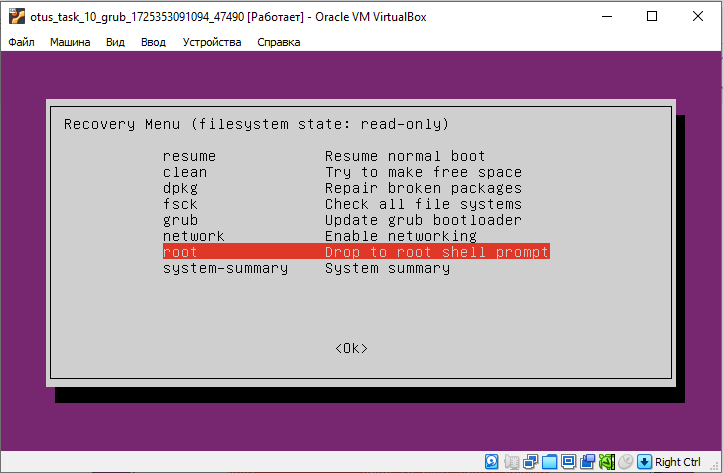

### OTUS Linux Professional Lesson #11 

#### ЦЕЛЬ:
* Научиться попадать в систему без пароля
* Устанавливать систему с LVM и переименовывать в VG

#### ЗАДАНИЕ 1: Попасть в систему без пароля несколькими способами

**Споcоб 1. init=/bin/bash**
По умолчанию меню загрузчика Grub скрыто и нет задержки при загрузке. Для отображения меню нужно отредактировать конфигурационный файл.
```
nano /etc/default/grub
```
Комментируем строку, скрывающую меню и ставим задержку для выбора пункта меню в 10 секунд.
```
#GRUB_TIMEOUT_STYLE=hidden
GRUB_TIMEOUT=10
```
Обновляем конфигурацию загрузчика и перезагружаемся для проверки.
```
update-grub
reboot
```
Для получения доступа необходимо при запуске машины и при выборе ядра для загрузки нажать e - в данном контексте edit. Попадаем в окно, где мы можем изменить параметры загрузки.
В конце строки, начинающейся с _linux_, добавляем __init=/bin/bash__ и нажимаем __сtrl-x__ для загрузки в систему. Рутовая файловая система при этом монтируется в режиме Read-Only. Если нужно перемонтировать в Read-Write:
```
mount -o remount,rw /
```

**Способ 2. Recovery mode**

В меню загрузчика на первом уровне выбрать второй пункт (Advanced options…), далее загрузить пункт меню с указанием recovery mode в названии. 
Получим меню режима восстановления.

В этом меню сначала включаем поддержку сети (network) для того, чтобы файловая система перемонтировалась в режим read/write (либо это можно сделать вручную).
Далее выбираем пункт root и попадаем в консоль с пользователем root. Если вы ранее устанавливали пароль для пользователя root (по умолчанию его нет), то необходимо его ввести. 
В этой консоли можно производить любые манипуляции с системой. Например сменить пароль root.

Вводим __passwd__ затем новый пароль.


После чего можно перезагружаться и заходить в систему с новым паролем. Полезно, когда мы потеряли или вообще не имели пароля администратора.


#### ЗАДАНИЕ 2. Установить систему с LVM, после чего переименовать VG

1. Смотрим текущее состояние системы и переименовываем VG:
```
root@grub:~# vgs
  VG        #PV #LV #SN Attr   VSize  VFree
  ubuntu-vg   2   0   0 wz--n- 62.00g 31.00g

root@grub:~# vgrename ubuntu-vg ubuntu-otus
  Volume group "ubuntu-vg" successfully renamed to "ubuntu-otus"
```
2. Далее правим /boot/grub/grub.cfg. Везде заменяем старое название VG на новое::
```
linux   /boot/vmlinuz-5.15.0-71-generic root=/dev/mapper/ubuntu--otus-ubuntu--lv ro net.ifnames=0 biosdevname=0
```

3. Перезагружаемся и проверяем что мы загрузились с новым именем Volume Group
```
root@grub:~# vgs
  VG        #PV #LV #SN Attr   VSize  VFree
  ubuntu-otus 2   0   0 wz--n- 62.00g 31.00g
```